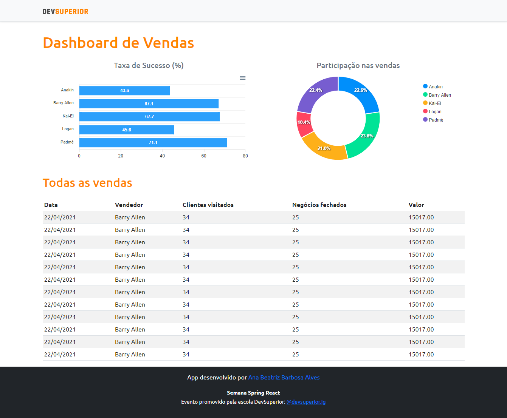

# SDS4 - DSVendas

Esse projeto consiste em exibir uma Dashboard de vendas a partir de dados fornecidos pelo backend.



---

## 🚀 Tecnologias e Ferramentas

Esse projeto foi desenvolvido com as seguintes tecnologias e ferramentas:

- Java
- Spring Boot
- JPA / Hibernate
- Maven
- HTML
- CSS
- Typescript
- React
- Bootstrap
- Heroku
- Netlify
- PostgreSQL
- Postman
- Visual Studio Code
- Eclipse
- Spring Tool Suite
- Git

---

### Modelo Conceitual


### Padrão camadas adotado


### Frontend

[Layout](https://sds4-dsvendas-ana.netlify.app/)

### Backend

[All sellers](https://sds4-ana.herokuapp.com/sellers)

[Sales pagination](https://sds4-ana.herokuapp.com/sales?page=0&size=20&sort=date,desc)
``` 
 Parâmetros:

 page -> Passa para a consulta o número da página a ser navegada
 size -> Passa para a consulta o seu respectivo tamanho (quantidade de registros)
 sort -> Indica qual dos campos da entidade vão ser utilizados como referência para ordenação 

 Exemplos:
 {{host}}/sales?page=1
 {{host}}/sales?size=10
 {{host}}/sales?sort=date
 {{host}}/sales?page=1&size=10
 {{host}}/sales?size=10&sort=date

 Vale ressaltar um detalhe importante é que a primeira pagina começa do zero não do 1
 ```


[Amount by seller](https://sds4-ana.herokuapp.com/sales/amount-by-seller)

[Success by seller](https://sds4-ana.herokuapp.com/sales/success-by-seller)

> A extensão [JSON Viewer](https://chrome.google.com/webstore/detail/json-viewer/gbmdgpbipfallnflgajpaliibnhdgobh/related?hl=pt-BR) proporciona uma experiência mais agradável para visualizar os dados


---

Feito por Ana Beatriz com ensinamentos da escola DevSuperior!