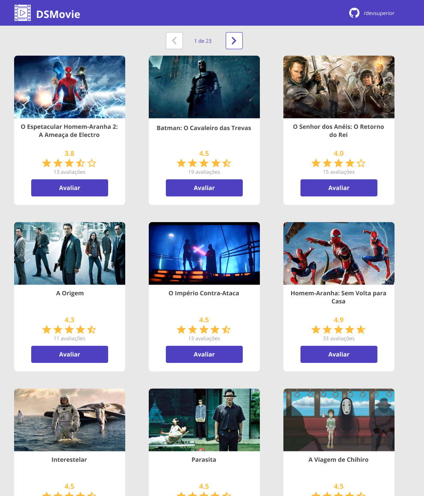
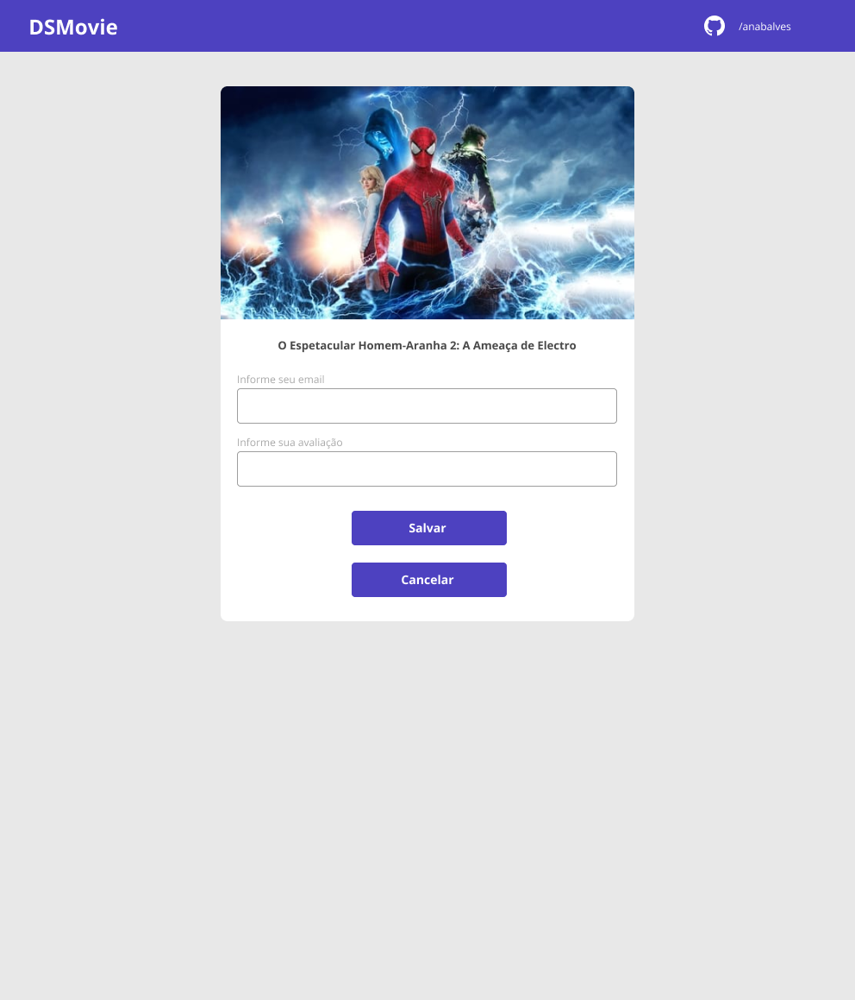
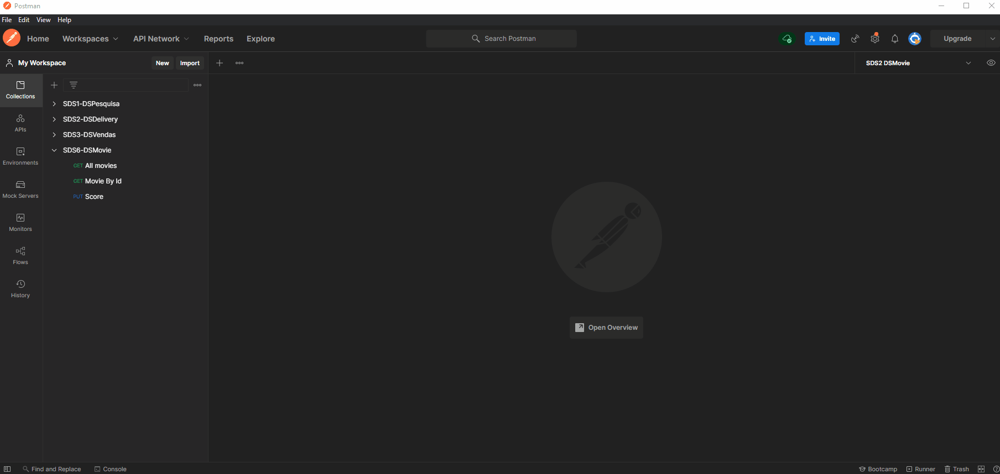

# SDS9 - DSMeta

DSMeta é uma aplicação construída durante a 9ª edição da Semana Spring React organizada pela DevSuperior.

A aplicação consiste em uma consulta de vendas, no qual podemos buscar vendas em um dado intervalo de datas, e notificar via SMS os dados dos melhores vendedores.

  

---

## 🚀 Tecnologias e Ferramentas

Esse projeto foi desenvolvido com as seguintes tecnologias e ferramentas:

- Java
- Spring Boot
- JPA / Hibernate
- Maven
- HTML / CSS / JavaScript / TypeScript
- ReactJS
- Vite
- Heroku
- Netlify
- H2
- PostgreSQL
- Postman
- Visual Studio Code
- Intellij
- Git

---

### Modelo Conceitual

  

---

### Layout

  
  

---

### Backend

  

---

Feito por Ana Beatriz com ensinamentos da escola DevSuperior!
