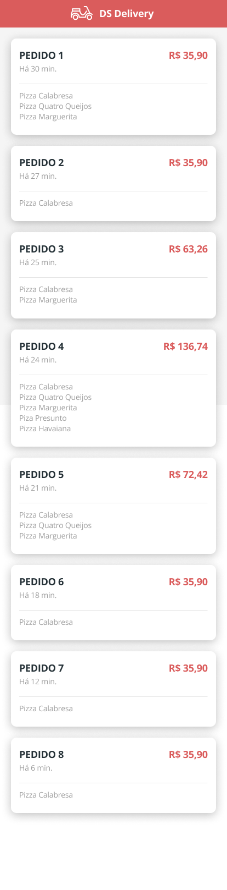
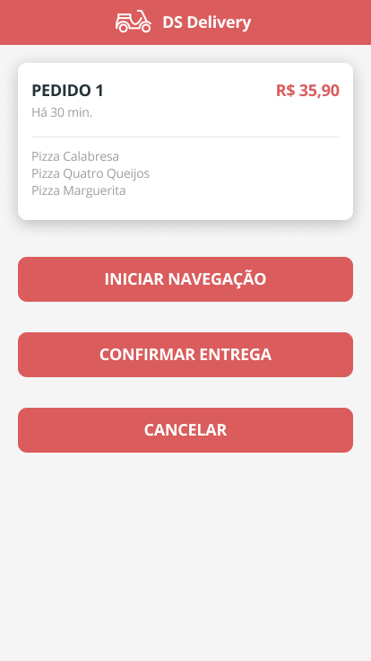
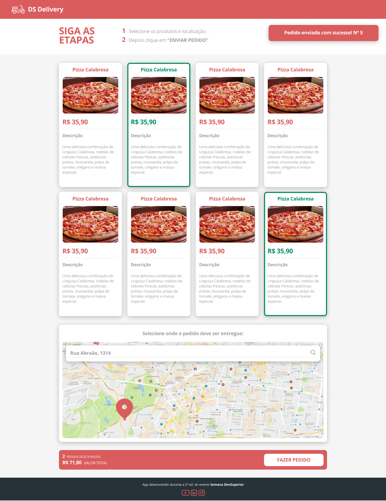

# SDS2 - DS Delivery

[DS Delivery](https://sds2-dsdelivery-ana.netlify.app/) é uma aplicação construída durante a 2ª edição da Semana Spring React organizada pela DevSuperior.

A aplicação consiste em um delivery de comida, os pedidos são realizados na aplicação web e depois via app mobile o entregador poderá acompanhar os pedidos e confirmar a entrega.

  
  

---

## 🚀 Tecnologias e Ferramentas

Esse projeto foi desenvolvido com as seguintes tecnologias e ferramentas:

- Java
- Spring Boot
- JPA / Hibernate
- Maven
- HTML / CSS / JavaScript / TypeScript
- ReactJS
- React Native
- Expo
- Heroku
- Netlify
- PostgreSQL
- Postman
- Visual Studio Code
- Eclipse
- Spring Tool Suite
- Git

---

### Modelo Conceitual

  

### Layout Mobile

  

  

  

### Layout Web

  
  

### Backend

  

[All products](https://sds2-anabalves.herokuapp.com/products)

[All orders](https://sds2-anabalves.herokuapp.com/orders)

> A extensão [JSON Viewer](https://chrome.google.com/webstore/detail/json-viewer/gbmdgpbipfallnflgajpaliibnhdgobh/related?hl=pt-BR) proporciona uma experiência mais agradável para visualizar os dados

---

Feito por Ana Beatriz com ensinamentos da escola DevSuperior!
