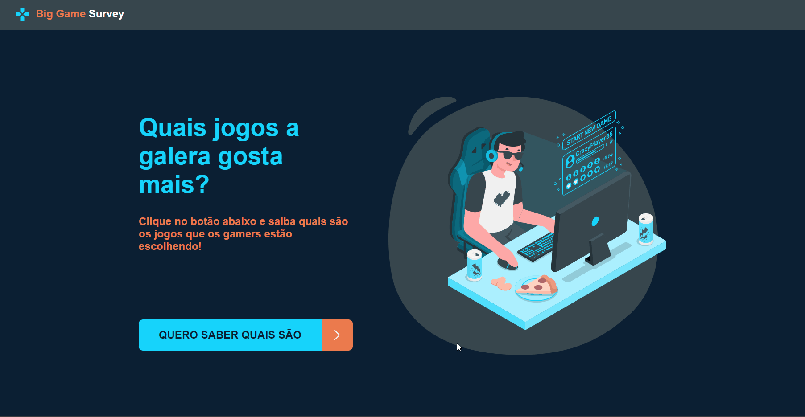
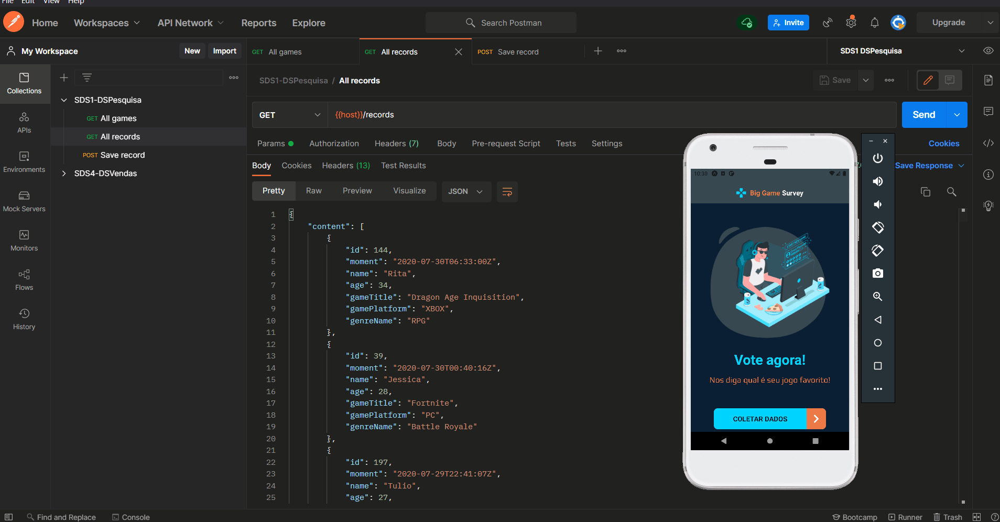
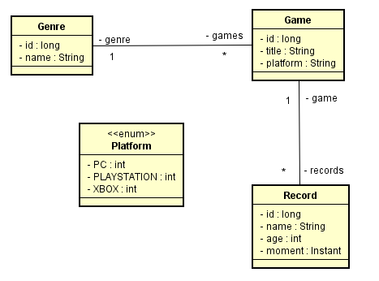
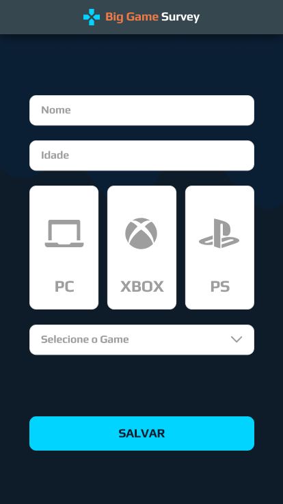
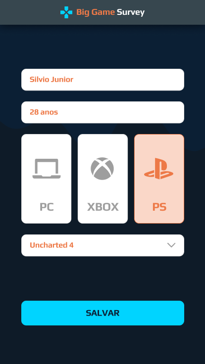
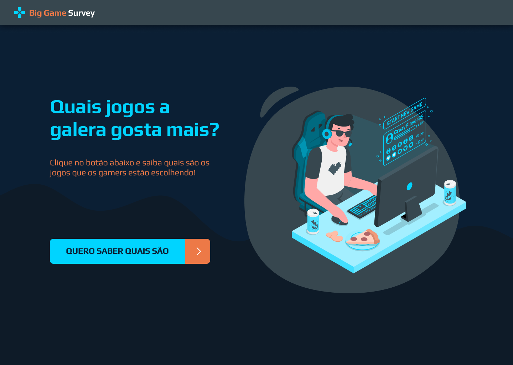
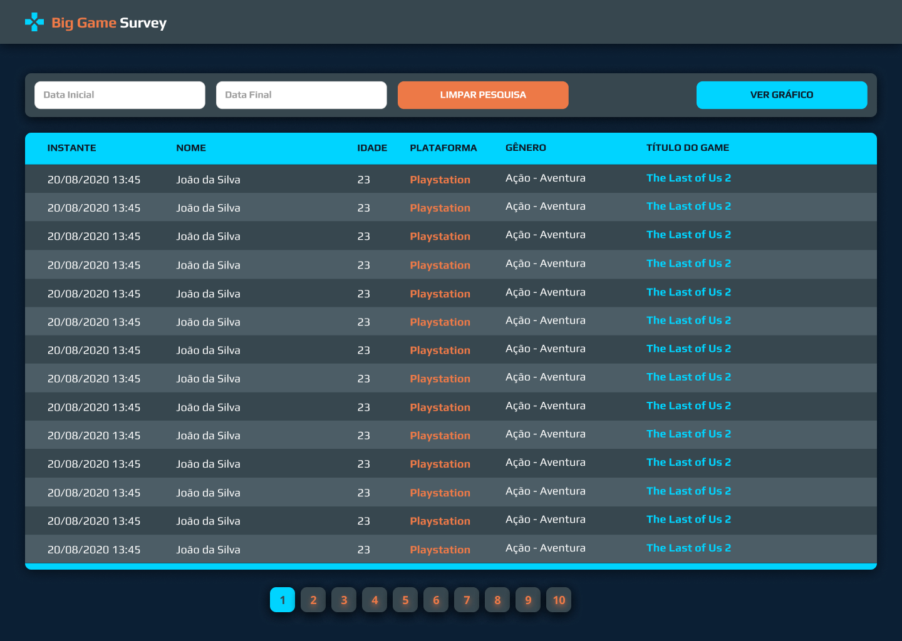
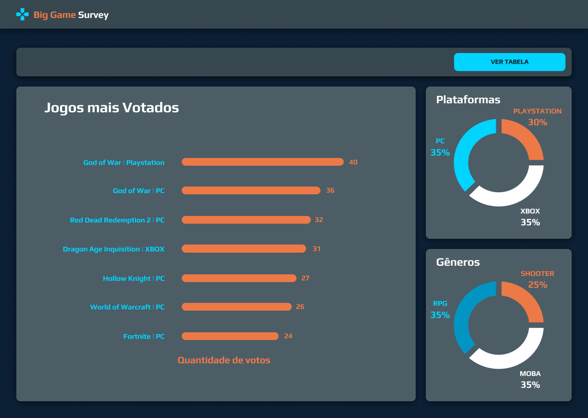
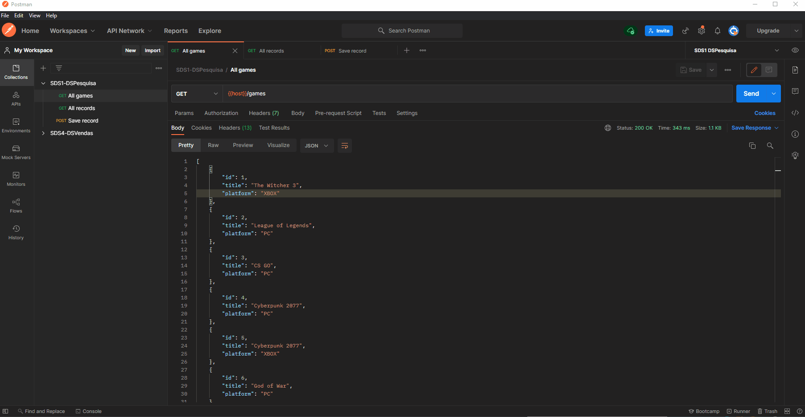

# SDS1 - DSPesquisa - Big Game Survey

[Big Game Survey](https://sds1-dspesquisa-ana.netlify.app/) é uma aplicação construída durante a 1ª edição da Semana Spring React organizada pela DevSuperior.

A aplicação consiste em uma pesquisa de preferência de jogos, os dados são coletados via app mobile e depois listados na aplicação web, que possui uma dashboard com gráficos baseados nesses dados.

  
  

## 🚀 Tecnologias e Ferramentas

Esse projeto foi desenvolvido com as seguintes tecnologias e ferramentas:

- Java
- Spring Boot
- JPA / Hibernate
- Maven
- HTML / CSS / JavaScript / TypeScript
- ReactJS
- React Native
- Apex Charts
- Expo
- Heroku
- Netlify
- PostgreSQL
- Postman
- Visual Studio Code
- Eclipse
- Spring Tool Suite
- Git

---

### Modelo Conceitual

  

### Layout Mobile

  
  
  

### Layout Web

  
  
  

### Backend

  

[All games](https://sds1-anabalves.herokuapp.com/games)

[All records](https://sds1-anabalves.herokuapp.com/records)

> A extensão [JSON Viewer](https://chrome.google.com/webstore/detail/json-viewer/gbmdgpbipfallnflgajpaliibnhdgobh/related?hl=pt-BR) proporciona uma experiência mais agradável para visualizar os dados

---

Feito por Ana Beatriz com ensinamentos da escola DevSuperior!
